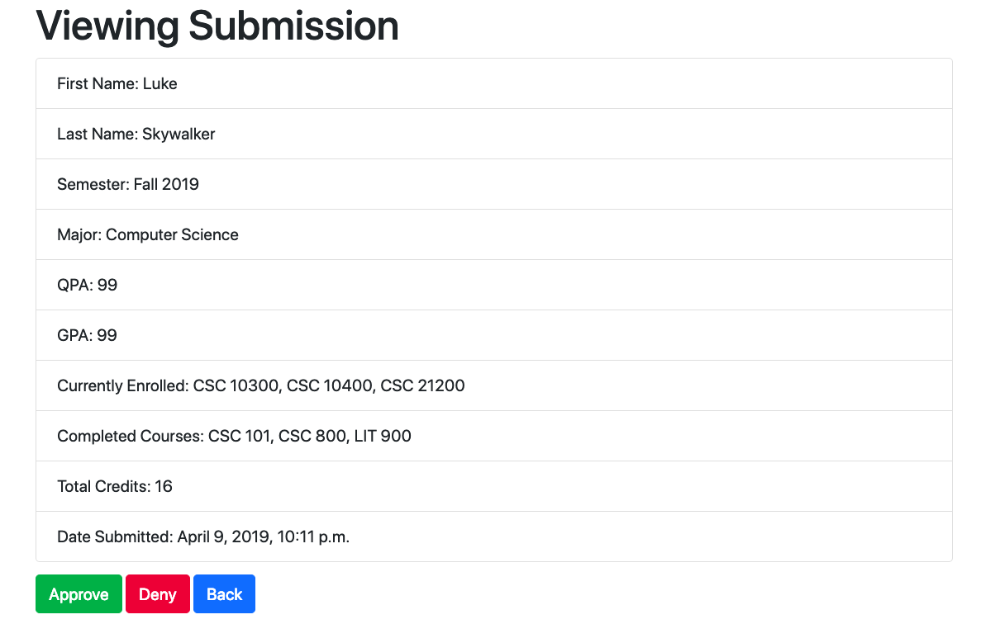
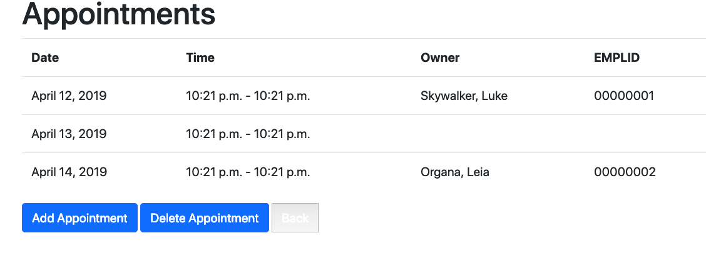
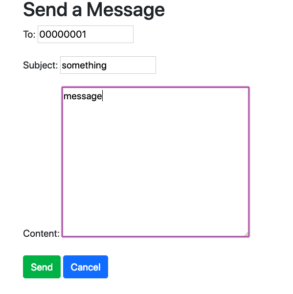
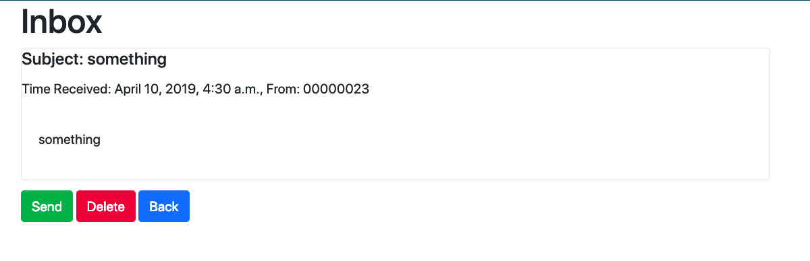

# QuickReg

### John Chen, Moiya Josephs, Anjana Rajan, Carlton Welch

## Setup

1. Move to quickreg directory
```
$ cd quickreg
```
2. Create virtual environment (only required on initial setup)
```
$ python3 -m venv ~/.virtualenvs/quickreg
```
3. Activate virtual environment
```
$ source ~/.virtualenvs/mysite/bin/activate
```
4. Install Django (only required on initial setup)
```
$ pip install Django
```
5. Launch QuickReg
```
$ python3 manage.py runserver
```
6. Open browser (optimized for Firefox) and navigate to server location (http://localhost:8000/)

## Documentation


- Login Page that appears when entering the website.


- New User will enter their user type.
### Student


Student homepage, here the user can select to request appointments, view courses, submit advising forms and send messages.


Student can request appointments based on Faculty's given availabilities.


Student can request appointment from the dates available.


Student can submit an advising form. Providing the given information and then submitting it.


### Faculty and Crystal User


Faculty can Add and Delete any courses.


Faculty can view adivising based on the unique ID from each student.



Here the faculty can view the request to be advised in detail and either request or deny it.



## General User


Message can be sent to a unique user based off of their EMPLID.



User can view their inbox and reply by clicking send, or delete the message.
