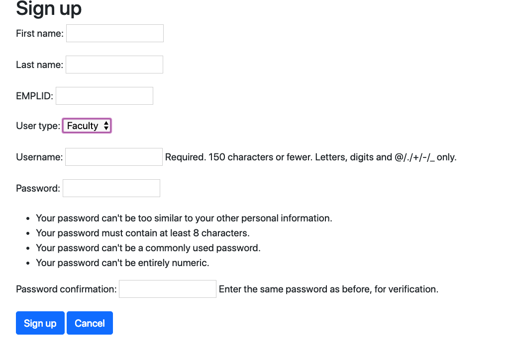
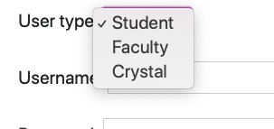
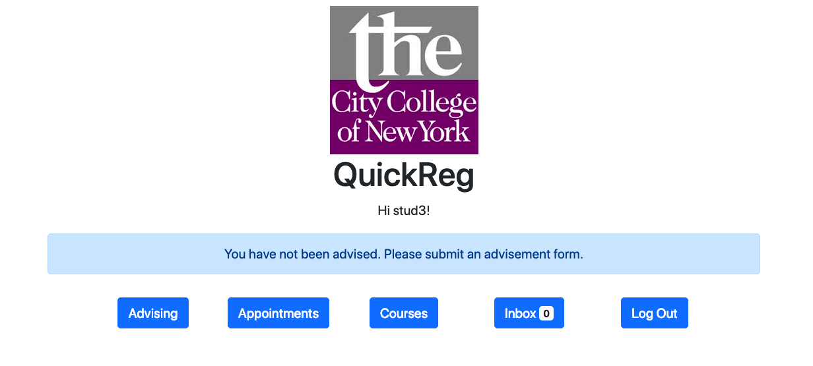
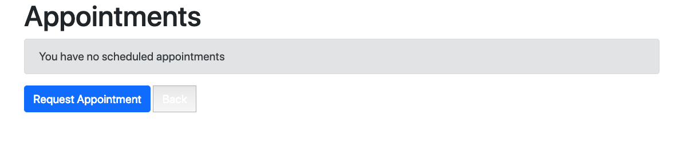
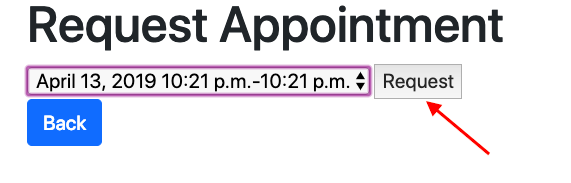
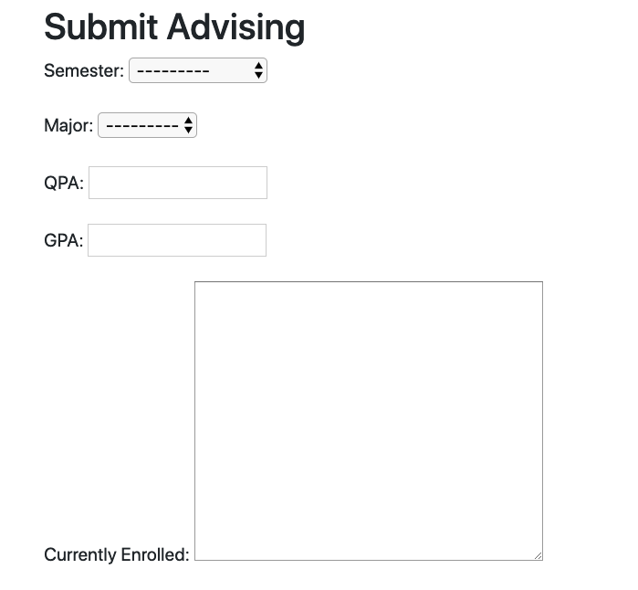
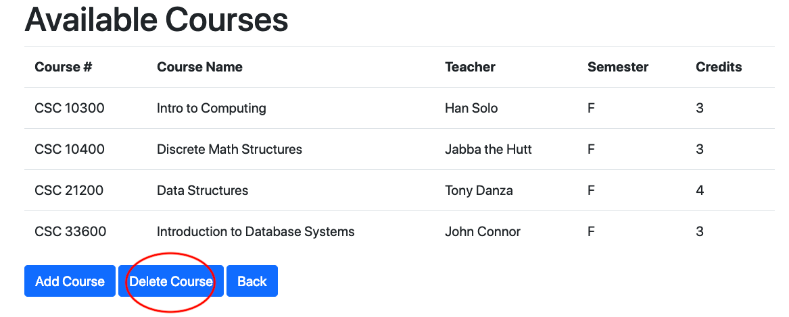
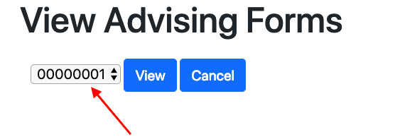

# QuickReg

### John Chen, Moiya Josephs, Anjana Rajan, Carlton Welch

## Setup

1. Move to quickreg directory
```
$ cd quickreg
```
2. Create virtual environment (only required on initial setup)
```
$ python3 -m venv ~/.virtualenvs/quickreg
```
3. Activate virtual environment
```
$ source ~/.virtualenvs/mysite/bin/activate
```
4. Install Django (only required on initial setup)
```
$ pip install Django
```
5. Launch QuickReg
```
$ python3 manage.py runserver
```
6. Open browser (optimized for Firefox) and navigate to server location (http://localhost:8000/)

## Documentation


Login Page that appears when entering the website.


New User will enter their user type.
### Student


Student can view appointments already scheduled.

Student can request appointment from the dates available.

Student can submit an advising form. Providing the given information and then submitting it.


### Faculty





